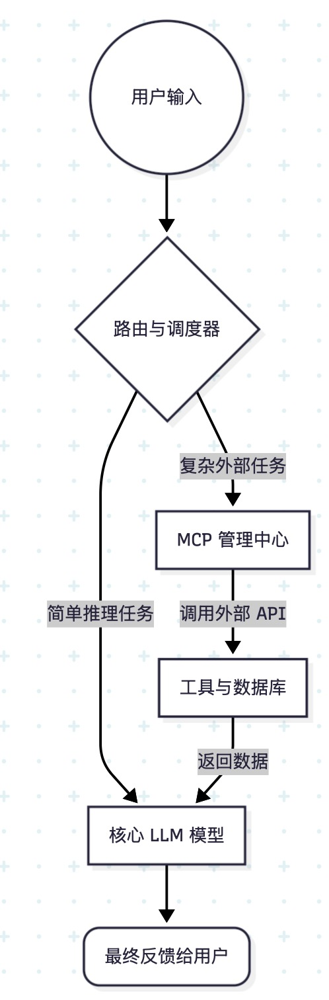

# 对于 AI、LLM 和 Agent 的技术架构解析

随着大语言模型（LLM）的成熟，AI 技术的落地应用呈现出明显的层次结构。对于开发者与深度用户而言，理清 Application、LLM 与 Agent 之间的边界及交互逻辑，是理解现代 AI 范式的关键。

## 1. Application（应用层）：交互与协议

AI 应用（如豆包、千问、元宝等）是用户与模型交互的入口。其核心价值在于提供统一的用户界面（UI）及任务路由机制。

在这些应用中，模型本身并不直接具备处理外部数据的能力。为了使模型能够与本地环境、互联网或特定数据库交互，业界引入了 **MCP（Model-Context Protocol，模型上下文协议）**。

* **MCP 的定义**：MCP 是一套标准化的通信协议，旨在解决 AI 模型与外部数据源或工具之间的标准化连接问题。
* **功能实现**：应用通过加载不同的 MCP 服务端（Server），为模型提供 API 接口能力。应用的集成能力（如千问的购物功能、元宝的地图服务）取决于其集成的 MCP 协议种类与质量。

## 2. LLM（模型层）：核心推理引擎

LLM 是整个系统的逻辑处理核心，负责信息的理解、推理与文本生成。

当前市场上存在多种模型架构，如 DeepSeek-V3.2、Qwen-3.5、Gemini-3 等。在应用架构中，模型并不直接暴露给用户，而是通过“路由调度器”根据任务类型进行动态分发。

典型的应用交互架构如下：

在这个架构中，模型负责处理语义，而路由机制决定了模型在特定场景下是否能调用高效工具。

## 3. Agent 与 OpenClaw：复杂任务编排

如果说 LLM 是推理引擎，那么 Agent（智能体）则是基于 LLM 构建的自动化执行系统。

以 OpenClaw 为例，Agent 系统的核心功能远不止于简单的单轮对话，其主要包含以下技术模块：

* **任务规划（Task Planning）**：将复杂的高级指令拆解为一系列可执行的子任务序列。
* **工具调用（Skill Execution）**：不仅限于 MCP，还包括对复杂业务逻辑的 Skill 封装，使 AI 能够自主决策使用哪种工具。
* **上下文管理（Context Management）**：在长周期的任务执行过程中，维持对状态、偏好及中间结果的持久化记忆。
* **自主纠错**：Agent 具备闭环反馈能力，能够在任务执行失败时尝试替代方案。

## 结语

理解这一架构可以帮助我们更清晰地看待 AI 产品的性能瓶颈：

1. 若回答不够精准，是 **LLM** 的推理能力问题；
2. 若无法获取实时数据，是 **MCP** 协议的接入缺失；
3. 若无法完成复杂的长流程任务，则是 **Agent** 任务编排逻辑的优化空间。

掌握这三个维度的交互，即是掌握了现代 AI 的基础工作逻辑。

