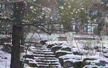

# Shadow in the Pixels: 视觉语言模型 (VLM) 的定向对抗攻击面

## 1. 引言：AI 的“视觉信任危机”

传统数字图像处理注重信号完整性，而现代多模态大模型（VLM）的核心在于“语义感知”。我们通常认为一张风景图就是一张风景图，但从神经网络的角度来看，它是高维空间中的一个向量。

如果我们能精准地通过反向传播计算出该向量的“偏向”，我们就能在不改变语义属性的前提下，利用极小的噪声激活特定的神经元路径，从而迫使模型输出预定义的错误文本——这便是**定向对抗攻击 (Targeted Adversarial Attack)**。

---

## 2. 技术剖析：如何“污染”感知空间

对抗攻击的核心在于解决一个约束优化问题。我们旨在寻找一个对抗样本 $x_{adv}$，使其在限制扰动预算 $\epsilon$ 的情况下，最大化模型对于目标文本 $y_{target}$ 的概率得分。

其核心更新逻辑为投影梯度下降 (PGD)：

$$x_{t+1} = \Pi_{x+\epsilon} \left( x_t + \alpha \cdot \text{sign}(\nabla_x \mathcal{L}(f(x_t), y_{target})) \right)$$

这里 $\mathcal{L}$ 是损失函数，我们通过迭代计算 loss 关于像素的梯度，从而找到让模型输出“预定答案”的最短路径。

---

## 3. 实验实战：在 RTX 5060Ti 上的本地复现

本次实验使用 **Qwen2.5-VL-3B-Instruct** 模型，在单张 16GB VRAM 的 5060Ti 上进行。该硬件配置在 `bfloat16` 精度下，完全能够支撑梯度计算与反向传播。

https://github.com/Suiseiseki-2016/qwenvl_hacker

---

## 4. 实验结果与分析

### 4 人类视角 vs 模型视角

人类在观察对抗样本时，通常无法感知到差异，但模型内部的激活状态已发生翻天覆地变化。

* **原始图片：** 
* **对抗样本：** 

对抗样本会让模型输出“我是神里绫华的狗！”

---

## 5. 讨论与防御思考

本次实验表明，VLM 在面对结构化攻击时表现出极强的脆弱性。这提示我们，在部署多模态 AI 服务时：

1. **对抗训练 (Adversarial Training)：** 将此类对抗样本加入训练集，提升模型的鲁棒性。
2. **输入预处理 (Input Sanitization)：** 通过随机裁剪、JPEG 压缩或特征平滑，在推理前破坏掉精密的梯度扰动。
3. **多模型验证：** 部署多模型集成检测，防止单个模型被特定扰动误导。

---

## 6. 免责声明

本文内容仅用于安全学术交流与教学演示，旨在帮助研究人员了解并提升模型的防御水平。严禁将文中提及的技术用于任何非法攻击、骚扰或未经授权的系统入侵活动。实验请在本地封闭环境中进行。

---
